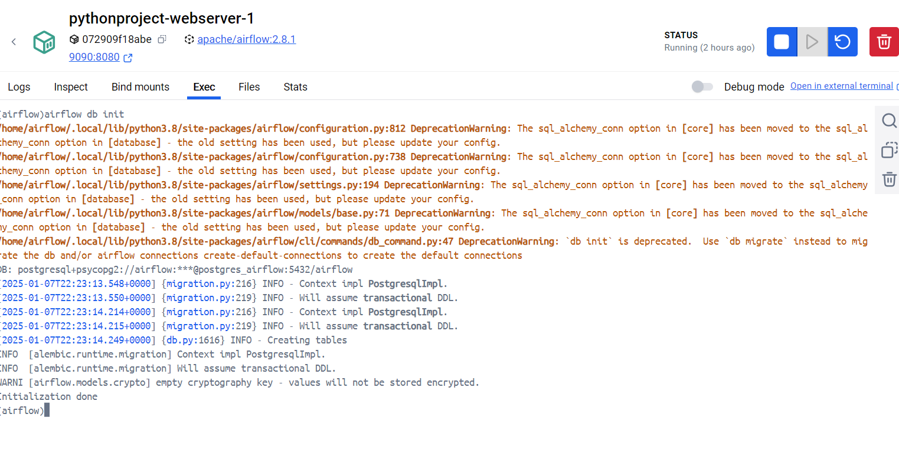
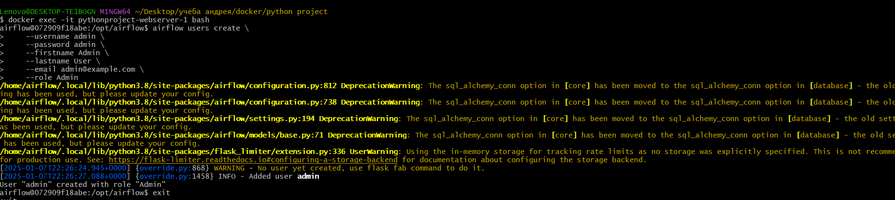
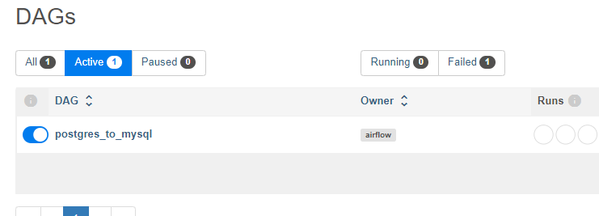

# Перенос данных между PostgreSQL и MySQL с использованием Apache Airflow

В рамках финального проекта требуется выполнить задачу по переносу данных из одной базы данных в другую с помощью Apache Airflow. Для оптимизации работы и упрощения развертывания проекта, весь стек сервисов (PostgreSQL, MySQL, Apache Airflow) запускается в контейнерах Docker.

## Этапы реализации

### 1. Развертывание баз данных и Apache Airflow в Docker

Для упрощения развертывания всех сервисов был составлен `docker-compose.yml`, который автоматически поднимет контейнеры для PostgreSQL, MySQL и Apache Airflow.

- **PostgreSQL** (с базой данных `shop`) будет работать на порту 5433.
- **MySQL** будет использоваться для хранения аналитических данных.
- **Apache Airflow** запускается с PostgreSQL для метаданных на порту 9090 (по умолчанию использует порт 8080).

### 2. Заполнение базы данных PostgreSQL фейковыми данными

Для тестирования в базу `shop` в PostgreSQL были добавлены фейковые данные. Код для генерации данных находится в файле `postgre_db.py`. 

### 3. Создание таблиц в MySQL

Создается пустая таблица в базе MySQL, которая будет использоваться для хранения данных, перегоняемых из PostgreSQL.

### 4. Создание пользователя в Apache Airflow

После развертывания Airflow, необходимо создать пользователя для доступа к веб-интерфейсу. Это можно сделать через командную строку внутри контейнера с Airflow.

### 5. Создание DAG для переноса данных

Создается DAG в Airflow для переноса данных из PostgreSQL в MySQL. DAG файл находится в проекте под именем `postgres_to_mysql_dag.py`. Этот файл настроен для выполнения задачи ETL (Extract, Transform, Load).

### 6. Запуск DAG через веб-интерфейс

Веб-интерфейс Apache Airflow доступен на порту 9090. Здесь можно вручную запустить DAG и мониторить его выполнение.

## Описание файлов

- `docker-compose.yml`: описание контейнеров для PostgreSQL, MySQL и Apache Airflow.
- `create_db.sql`: скрипт для создания таблиц в базе данных `shop`.
- `postgre_db.py`: Python-скрипт для заполнения таблиц в PostgreSQL фейковыми данными.
- `postgres_to_mysql_dag.py`: DAG для Apache Airflow, который отвечает за перенос данных из PostgreSQL в MySQL.

## Особенности

- Для веб-интерфейса Apache Airflow используется порт 9090, так как порт 8080 был занят.
- База данных `shop` работает на порту 5433 вместо стандартного 5432.
- В качестве базы метаданных для Apache Airflow используется PostgreSQL вместо SQLite, поскольку SQLite вызывал слишком много ошибок при запуске. Возможно, можно использовать SQLite, но на данный момент настройка с PostgreSQL работает стабильно.

# Структура базы данных PostgreSQL

В проекте используется база данных PostgreSQL, которая содержит несколько таблиц для хранения данных. Вот описание всех таблиц и их полей.

## Таблицы базы данных
```sql
CREATE TABLE users (
    id SERIAL PRIMARY KEY,        -- Идентификатор пользователя (автоинкремент)
    first_name VARCHAR(100),      -- Имя пользователя
    last_name VARCHAR(100),       -- Фамилия пользователя
    email VARCHAR(100) UNIQUE,    -- Электронная почта (уникальное поле)
    registration_date  TIMESTAMP DEFAULT CURRENT_TIMESTAMP, -- Дата регистрации пользователя
    loyalty_status VARCHAR(20)    -- Статус лояльности
);
CREATE TABLE Products (
    product_id SERIAL PRIMARY KEY, -- Идентификатор продукта (автоинкремент)
    name VARCHAR(100),             -- Наименование продукта
    description TEXT,              -- Описание продукта
    category_id INTEGER,           -- Ссылка на таблицу с категориями продукта
    price DECIMAL(10, 2),          -- Цена
    stock_quantity INTEGER,        -- Количество
    creation_date TIMESTAMP DEFAULT CURRENT_TIMESTAMP -- Дата создания
);
 
CREATE TABLE Orders (
    order_id SERIAL PRIMARY KEY,    -- Идентификатор заказа (автоинкремент)
    user_id INTEGER REFERENCES Users(user_id), -- Ссылка на таблицу с пользователями
    order_date TIMESTAMP DEFAULT CURRENT_TIMESTAMP, -- Дата заказа
    total_amount DECIMAL(10, 2),    -- Общее количество
    status VARCHAR(20),             -- Статус заказа
    delivery_date TIMESTAMP         -- Дата доставки   
);
 
CREATE TABLE OrderDetails (
    order_detail_id SERIAL PRIMARY KEY, -- Идентификатор деталей заказа (автоинкремент)
    order_id INTEGER REFERENCES Orders(order_id), -- ссылка на таблицу заказов
    product_id INTEGER REFERENCES Products(product_id), -- ссылка на таблицу продуктов
    quantity INTEGER,               -- количество
    price_per_unit DECIMAL(10, 2),  -- цена на 1 товар
    total_price DECIMAL(10, 2)      -- общая цена
);
 
CREATE TABLE ProductCategories (
    category_id SERIAL PRIMARY KEY, -- Идентификатор категории продуктов (автоинкремент)
    name VARCHAR(50),               -- Наименование категории
    parent_category_id INTEGER      -- Идентификатор родительской категории
);
```
## Как запустить проект

1. Убедитесь, что Docker и Docker Compose установлены.
2. Склонируйте репозиторий:
   ```bash
   git clone https://github.com/andrey-osadchiy/hse_python.git
   cd hse_python/Final_project

3.Запустите Docker Compose:
  ```bash
   docker-compose up -d
```
4.Создайте таблицы в shop. Заполните базу данных PostgreSQL фейковыми данными:
```python
python postgre_db.py
```
5. Создайте таблицу в Mysql в базе shop
```sql
CREATE TABLE category_summary (
  category_name VARCHAR(255),
  cnt_u_id INT,
  all_quantity INT,
  total_price DECIMAL(10, 2),
  PRIMARY KEY (category_name)
);
```
6.Инициализируйте базу данных Apache Airflow:
```bash
docker-compose exec webserver airflow db init
```


7. Создайте пользователя в интерфейсе Airflow (если еще не создан).



8. Добавьте свой DAG в Airflow и проверьте его в веб-интерфейсе на порту 9090.



9. Запустите DAG через веб-интерфейс.


